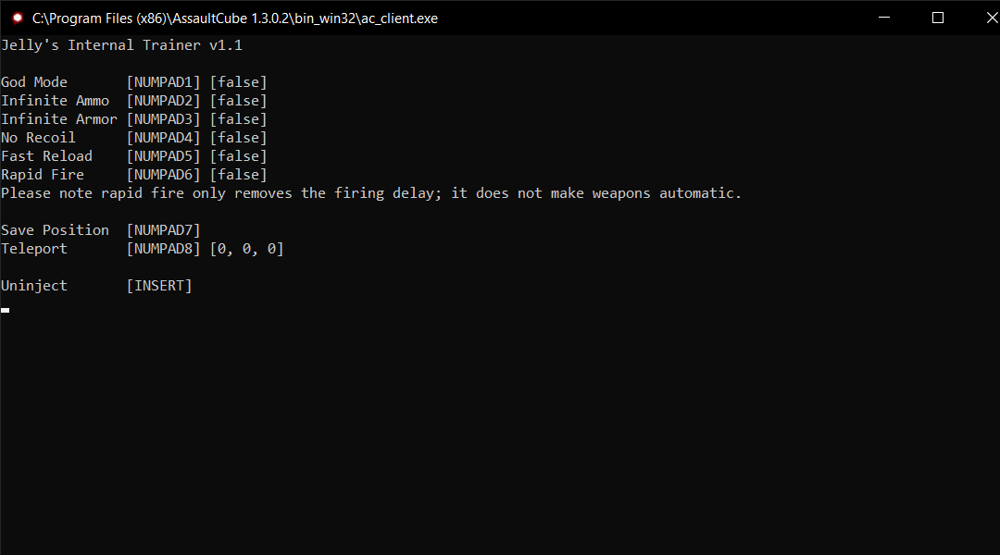

# Assault Cube Internal
A simple, internal cheat for Assault Cube made in C++

## Features
- God Mode (Infinite Health)
- Infinite Ammo
- Infinite Armor
- No Recoil
- Quick Reload
- Rapid Fire
- Teleportation
### Menu


## License
More info on the license can be found in the [LICENSE](https://github.com/jellyfruit/Assault-Cube-Internal/blob/main/LICENSE) file

## Compiling
### Windows
You will need **Microsoft Visual Studio 2022** with the **Desktop development with C++** workload installed

### Compiling from source
Download the repository as a .zip or clone the repository with
```
git clone https://github.com/jellyfruit/Assault-Cube-Internal.git
```

Extract the .zip or open the folder you cloned and open `AssaultCubeInternal.sln`
<br>
Ensure the build configuration is set to **Release | x86**. 
<br>
Press **Build solution** and you should recieve a .dll file under a Release subdirectory of wherever you saved the source.

## Injection
To use the cheat, you will need a DLL injector. Some popular ones include
- [Extreme Injector](https://github.com/master131/ExtremeInjector/releases/tag/v3.7.3)
- [Process Hacker 2](https://processhacker.sourceforge.io/downloads.php)
- [GH Injector](https://github.com/guided-hacking/GuidedHacking-Injector) (must compile from source)

### How to Inject
Launch the Assault Cube game. 
<br>
Select `ac_client.exe` as the process to inject into in your injector and the `AssaultCubeInternal.dll` file you got earlier.
<br>
Inject the DLL into the game. A menu should appear and you can start using the trainer!
